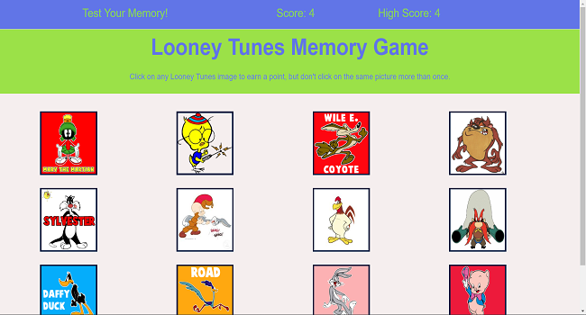

# :rabbit: Looney Tunes React-Memory-Game

### Overview
Looney Tunes React-Memory-Game is a memory game using React.  The applications UI is broken up into components to manage state and respond to user events.

Users have a choice of 12 Looney Tunes characters to click.  They can click an image only once.  After an image is  clicked the board is shuffled and they must select a different character...and so on.  The number of successful selections is tracked, as well as the high score.  The user wins when they select all 12 character images without duplication.  The user loses when an image is clicked more than once.

### Functionality
  1. <strong>ReactJS</strong> React uses state to manage fast page rendering that responds to user events.
  2. <strong>Components</strong> The variables for components are passed down from the app file as props.  Compnents are created for each section of the app. This also enables us to use CSS to style each component separately and organize our file architecture.
  

### Link to App
* <strong>[Looney Tunes Memory Game](https://looneytunes-react-memorygame.herokuapp.com/)</strong>

### Technology
* ReactJS
* ReactDOM
* Heroku

### Screenshot
